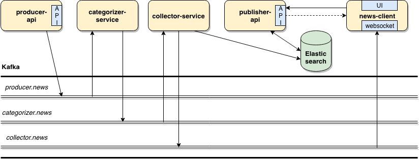
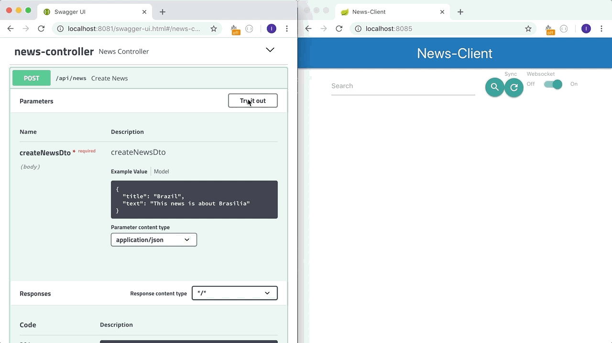
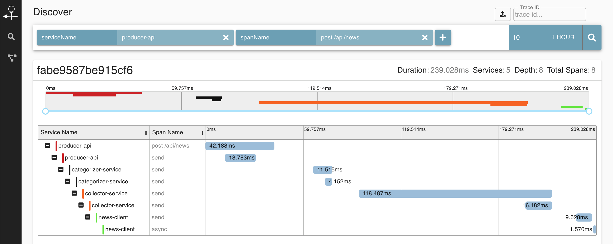
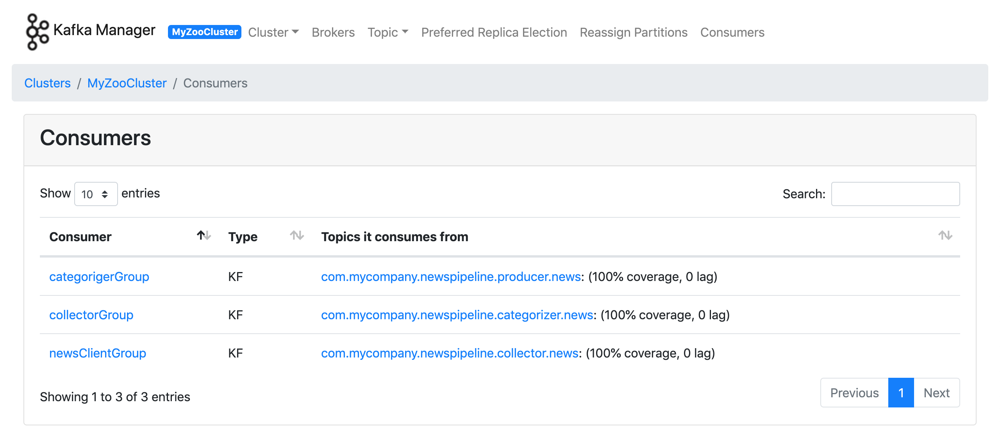
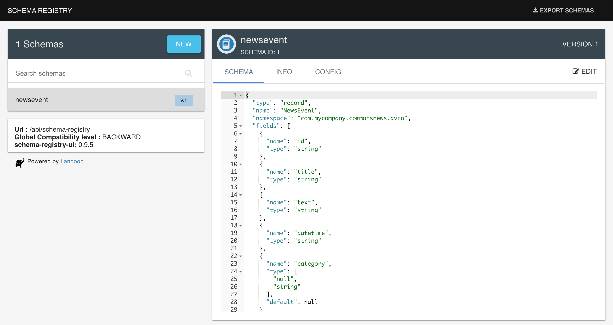

= spring-cloud-stream-kafka-elasticsearch

The goal of this project is to implement a "News" processing pipeline composed of five https://docs.spring.io/spring-boot/docs/current/reference/htmlsingle/[`Spring Boot`] applications: `producer-api`, `categorizer-service`, `collector-service`, `publisher-api` and `news-client`.

== Technologies used

* https://docs.spring.io/spring-cloud-stream/docs/current/reference/htmlsingle[`Spring Cloud Stream`] to build highly scalable event-driven applications connected with shared messaging systems;
* https://cloud.spring.io/spring-cloud-static/spring-cloud-schema-registry/1.0.6.RELEASE/reference/html/spring-cloud-schema-registry.html[`Spring Cloud Schema Registry`] that supports schema evolution so that the data can be evolved over time; besides, it lets you store schema information in a textual format (typically JSON) and makes that information accessible to various applications that need it to receive and send data in binary format;
* https://docs.spring.io/spring-data/elasticsearch/docs/current/reference/html/[`Spring Data Elasticsearch`] to persist data in https://www.elastic.co/products/elasticsearch[`Elasticsearch`];
* https://cloud.spring.io/spring-cloud-static/spring-cloud-openfeign/current/reference/html/[`Spring Cloud OpenFeign`] to write web service clients easily;
* https://www.thymeleaf.org/[`Thymeleaf`] as HTML template;
* https://zipkin.io[`Zipkin`] to visualize traces between and within applications;
* https://github.com/Netflix/eureka/wiki[`Eureka`] as service registration and discovery.

NOTE: In https://github.com/ivangfr/docker-swarm-environment[`docker-swarm-environment`] repository, it is shown how to deploy this project into a cluster of Docker Engines in swarm mode.

== Project Architecture

== Applications

* *producer-api*
+
`Spring Boot` Web Java application that creates news and pushes news events to `producer.news` topic in `Kafka`.

* *categorizer-service*
+
`Spring Boot` Web Java application that listens to news events in `producer.news` topic in `Kafka`, categorizes and pushes them to `categorizer.news` topic.

* *collector-service*
+
`Spring Boot` Web Java application that listens for news events in `categorizer.news` topic in `Kafka`, saves them in `Elasticsearch` and pushes the news events to `collector.news` topic.

* *publisher-api*
+
`Spring Boot` Web Java application that reads directly from `Elasticsearch` and exposes a REST API. It doesn't listen from `Kafka`.

* *news-client*
+
`Spring Boot` Web java application that provides a User Interface to see the news. It implements a `Websocket` that consumes news events from the topic `collector.news`. So, news are updated on the fly on the main page. Besides, `news-client` communicates directly with `publisher-api` whenever search for a specific news or news update are needed.
+
The `Websocket` operation is shown in the short gif below. News is created in `producer-api` and, immediately, it is shown in `news-client`.
+

== Prerequisites

* https://www.oracle.com/java/technologies/javase-jdk11-downloads.html[`Java 11+`]
* https://www.docker.com/[`Docker`]
* https://docs.docker.com/compose/install/[`Docker-Compose`]

== Generate NewsEvent

* In a terminal, make sure you are in `spring-cloud-stream-kafka-elasticsearch` root folder

* Run the following command to generate `NewsEvent`
+
[source]
----
./mvnw clean install --projects commons-news
----
+
It will install `commons-news-1.0.0.jar` in you local `Maven` repository, so that it can be visible by all services.

== Start Environment

* Open a terminal and inside `spring-cloud-stream-kafka-elasticsearch` root folder run
+
[source]
----
docker-compose up -d
----

* Wait until all containers are Up (healthy). You can check their status by running
+
[source]
----
docker-compose ps
----

== Running Applications with Maven

Inside `spring-cloud-stream-kafka-elasticsearch` root folder, run the following `Maven` commands in different terminals

* *eureka-server*
+
[source]
----
./mvnw clean spring-boot:run --projects eureka-server
----

* *producer-api*
+
[source]
----
./mvnw clean spring-boot:run --projects producer-api -Dspring-boot.run.jvmArguments="-Dserver.port=9080"
----

* *categorizer-service*
+
[source]
----
./mvnw clean spring-boot:run --projects categorizer-service -Dspring-boot.run.jvmArguments="-Dserver.port=9081"
----

* *collector-service*
+
[source]
----
./mvnw clean spring-boot:run --projects collector-service -Dspring-boot.run.jvmArguments="-Dserver.port=9082"
----

* *publisher-api*
+
[source]
----
./mvnw clean spring-boot:run --projects publisher-api -Dspring-boot.run.jvmArguments="-Dserver.port=9083"
----

* *news-client*
+
[source]
----
./mvnw clean spring-boot:run --projects news-client
----

== Running Applications as Docker containers

=== Build Application's Docker Image

* In a terminal, make sure you are in `spring-cloud-stream-kafka-elasticsearch` root folder

* In order to build the application's docker images, run the following script
+
[source]
----
./build-apps.sh
----

=== Application's Environment Variables

* *producer-api*
+
|===
|Environment Variable | Description

|`KAFKA_HOST`
|Specify host of the `Kafka` message broker to use (default `localhost`)

|`KAFKA_PORT`
|Specify port of the `Kafka` message broker to use (default `29092`)

|`SCHEMA_REGISTRY_HOST`
|Specify host of the `Schema Registry` to use (default `localhost`)

|`SCHEMA_REGISTRY_PORT`
|Specify port of the `Schema Registry` to use (default `8081`)

|`EUREKA_HOST`
|Specify host of the `Eureka` service discovery to use (default `localhost`)

|`EUREKA_PORT`
|Specify port of the `Eureka` service discovery to use (default `8761`)

|`ZIPKIN_HOST`
|Specify host of the `Zipkin` distributed tracing system to use (default `localhost`)

|`ZIPKIN_PORT`
|Specify port of the `Zipkin` distributed tracing system to use (default `9411`)

|===

* *categorizer-service*
+
|===
|Environment Variable | Description

|`KAFKA_HOST`
|Specify host of the `Kafka` message broker to use (default `localhost`)

|`KAFKA_PORT`
|Specify port of the `Kafka` message broker to use (default `29092`)

|`SCHEMA_REGISTRY_HOST`
|Specify host of the `Schema Registry` to use (default `localhost`)

|`SCHEMA_REGISTRY_PORT`
|Specify port of the `Schema Registry` to use (default `8081`)

|`EUREKA_HOST`
|Specify host of the `Eureka` service discovery to use (default `localhost`)

|`EUREKA_PORT`
|Specify port of the `Eureka` service discovery to use (default `8761`)

|`ZIPKIN_HOST`
|Specify host of the `Zipkin` distributed tracing system to use (default `localhost`)

|`ZIPKIN_PORT`
|Specify port of the `Zipkin` distributed tracing system to use (default `9411`)

|===

* *collector-service*
+
|===
|Environment Variable | Description

|`ELASTICSEARCH_HOST`
|Specify host of the `Elasticsearch` search engine to use (default `localhost`)

|`ELASTICSEARCH_NODES_PORT`
|Specify nodes port of the `Elasticsearch` search engine to use (default `9300`)

|`ELASTICSEARCH_REST_PORT`
|Specify rest port of the `Elasticsearch` search engine to use (default `9200`)

|`KAFKA_HOST`
|Specify host of the `Kafka` message broker to use (default `localhost`)

|`KAFKA_PORT`
|Specify port of the `Kafka` message broker to use (default `29092`)

|`SCHEMA_REGISTRY_HOST`
|Specify host of the `Schema Registry` to use (default `localhost`)

|`SCHEMA_REGISTRY_PORT`
|Specify port of the `Schema Registry` to use (default `8081`)

|`EUREKA_HOST`
|Specify host of the `Eureka` service discovery to use (default `localhost`)

|`EUREKA_PORT`
|Specify port of the `Eureka` service discovery to use (default `8761`)

|`ZIPKIN_HOST`
|Specify host of the `Zipkin` distributed tracing system to use (default `localhost`)

|`ZIPKIN_PORT`
|Specify port of the `Zipkin` distributed tracing system to use (default `9411`)

|===

* *publisher-api*
+
|===
|Environment Variable | Description

|`ELASTICSEARCH_HOST`
|Specify host of the `Elasticsearch` search engine to use (default `localhost`)

|`ELASTICSEARCH_NODES_PORT`
|Specify nodes port of the `Elasticsearch` search engine to use (default `9300`)

|`ELASTICSEARCH_REST_PORT`
|Specify rest port of the `Elasticsearch` search engine to use (default `9200`)

|`EUREKA_HOST`
|Specify host of the `Eureka` service discovery to use (default `localhost`)

|`EUREKA_PORT`
|Specify port of the `Eureka` service discovery to use (default `8761`)

|`ZIPKIN_HOST`
|Specify host of the `Zipkin` distributed tracing system to use (default `localhost`)

|`ZIPKIN_PORT`
|Specify port of the `Zipkin` distributed tracing system to use (default `9411`)

|===

* *news-client*
+
|===
|Environment Variable | Description

|`KAFKA_HOST`
|Specify host of the `Kafka` message broker to use (default `localhost`)

|`KAFKA_PORT`
|Specify port of the `Kafka` message broker to use (default `29092`)

|`SCHEMA_REGISTRY_HOST`
|Specify host of the `Schema Registry` to use (default `localhost`)

|`SCHEMA_REGISTRY_PORT`
|Specify port of the `Schema Registry` to use (default `8081`)

|`EUREKA_HOST`
|Specify host of the `Eureka` service discovery to use (default `localhost`)

|`EUREKA_PORT`
|Specify port of the `Eureka` service discovery to use (default `8761`)

|`ZIPKIN_HOST`
|Specify host of the `Zipkin` distributed tracing system to use (default `localhost`)

|`ZIPKIN_PORT`
|Specify port of the `Zipkin` distributed tracing system to use (default `9411`)

|===

=== Start Application's Docker Container

* In a terminal, make sure you are inside `spring-cloud-stream-kafka-elasticsearch` root folder

* Run following script
+
[source]
----
./start-apps.sh
----

== Applications URLs

|===
|Application |URL

|producer-api
|http://localhost:9080/swagger-ui.html

|publisher-api
|http://localhost:9083/swagger-ui.html

|news-client
|http://localhost:8080

|===

== Shutdown

* Stop applications
** If they were started with `Maven`, go to the terminals where they are running and press `Ctrl+C`
** If they were started as a Docker container, make sure you are in `spring-cloud-stream-kafka-elasticsearch` and run the script below
+
[source]
----
./stop-apps.sh
----

* Stop and remove docker-compose containers, networks and volumes
+
[source]
----
docker-compose down -v
----

== Useful links

* *Eureka*
+
`Eureka` can be accessed at http://localhost:8761
+
image::images/eureka-with-apps.png[]

* *Kafka Topics UI*
+
`Kafka Topics UI` can be accessed at http://localhost:8085

* *Zipkin*
+
`Zipkin` can be accessed at http://localhost:9411
+
The figure below shows an example of the complete flow a news passes through. It goes since `producer-api`, where the news is created, until `news-client`.
+

* *Kafka Manager*
+
`Kafka Manager` can be accessed at http://localhost:9000
+
The figure below shows the Kafka topics consumers. As we can see, the consumers are updated as the `lag` is `0`
+

+
_Configuration_
+
- First, you must create a new cluster. Click on `Cluster` (dropdown button on the header) and then on `Add Cluster`
- Type the name of your cluster in `Cluster Name` field, for example: `MyCluster`
- Type `zookeeper:2181` in `Cluster Zookeeper Hosts` field
- Enable checkbox `Poll consumer information (Not recommended for large # of consumers if ZK is used for offsets tracking on older Kafka versions)`
- Click on `Save` button at the bottom of the page.

* *Schema Registry UI*
+
`Schema Registry UI` can be accessed at http://localhost:8001
+

* *Elasticsearch REST API*
+
Check ES is up and running
+
[source]
----
curl localhost:9200
----
+
Check indexes in ES
+
[source]
----
curl "localhost:9200/_cat/indices?v"
----
+
Check _news_ index mapping
+
[source]
----
curl localhost:9200/news/_mapping
----
+
Simple search
+
[source]
----
curl "localhost:9200/news/_search?pretty"
----
