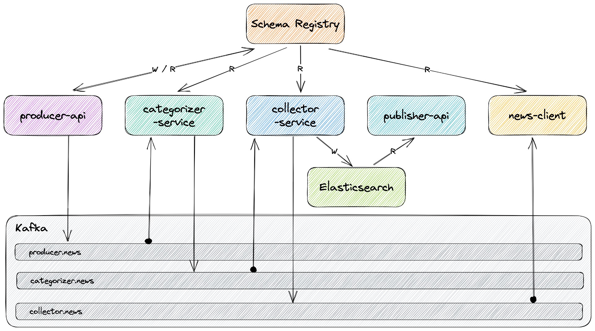
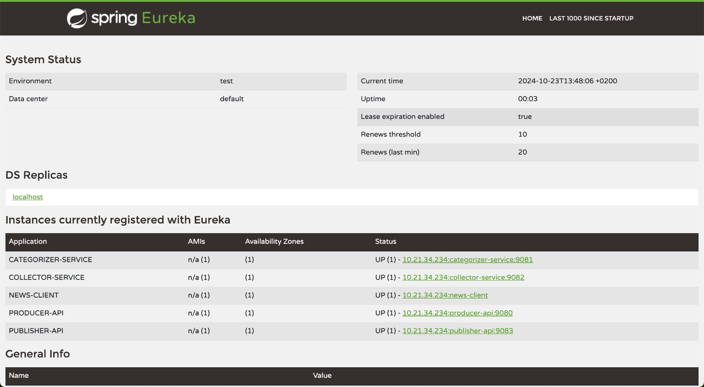
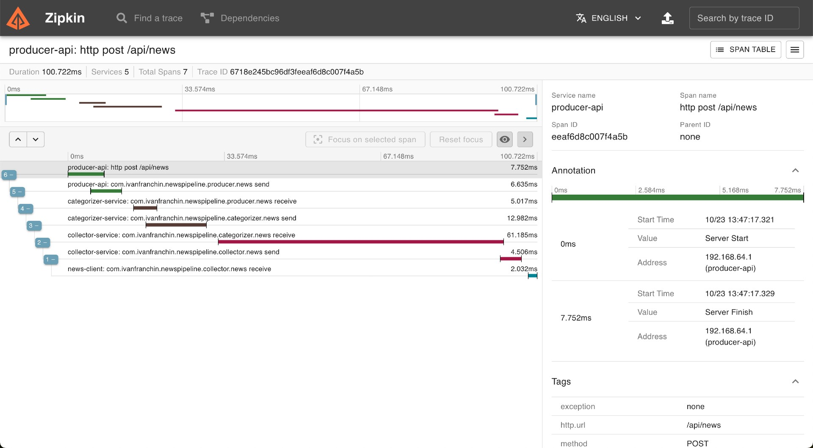

= spring-cloud-stream-kafka-elasticsearch

The goal of this project is to implement a "News" processing pipeline composed of five https://docs.spring.io/spring-boot/index.html[`Spring Boot`] applications: `producer-api`, `categorizer-service`, `collector-service`, `publisher-api` and `news-client`.

== Proof-of-Concepts & Articles

On https://ivangfr.github.io[ivangfr.github.io], I have compiled my Proof-of-Concepts (PoCs) and articles. You can easily search for the technology you are interested in by using the filter. Who knows, perhaps I have already implemented a PoC or written an article about what you are looking for.

== Additional Readings

* [Medium]: https://medium.com/@ivangfr/implementing-a-kafka-producer-and-consumer-using-spring-cloud-stream-d4b9a6a9eab1[**Implementing a Kafka Producer and Consumer using Spring Cloud Stream**]
* [Medium]: https://medium.com/@ivangfr/implementing-unit-tests-for-a-kafka-producer-and-consumer-that-uses-spring-cloud-stream-f7a98a89fcf2[**Implementing Unit Tests for a Kafka Producer and Consumer that uses Spring Cloud Stream**]
* [Medium]: https://medium.com/@ivangfr/implementing-end-to-end-testing-for-a-kafka-producer-and-consumer-that-uses-spring-cloud-stream-fbf5e666899e[**Implementing End-to-End testing for a Kafka Producer and Consumer that uses Spring Cloud Stream**]
* [Medium]: https://medium.com/@ivangfr/configuring-distributed-tracing-with-zipkin-in-a-kafka-producer-and-consumer-that-uses-spring-cloud-9f1e55468b9e[**Configuring Distributed Tracing with Zipkin in a Kafka Producer and Consumer that uses Spring Cloud Stream**]
* [Medium]: https://medium.com/@ivangfr/using-cloudevents-in-a-kafka-producer-and-consumer-that-uses-spring-cloud-stream-9c51670b5566[**Using CloudEvents in a Kafka Producer and Consumer that uses Spring Cloud Stream**]

== Technologies used

* https://docs.spring.io/spring-cloud-stream/docs/current/reference/html/[`Spring Cloud Stream`] to build highly scalable event-driven applications connected with shared messaging systems;
* https://docs.spring.io/spring-cloud-schema-registry/docs/current/reference/html/spring-cloud-schema-registry.html[`Spring Cloud Schema Registry`] that supports schema evolution so that the data can be evolved over time; besides, it lets you store schema information in a textual format (typically JSON) and makes that information accessible to various applications that need it to receive and send data in binary format;
* https://docs.spring.io/spring-data/elasticsearch/reference/[`Spring Data Elasticsearch`] to persist data in https://www.elastic.co/elasticsearch[`Elasticsearch`];
* https://docs.spring.io/spring-cloud-openfeign/docs/current/reference/html/[`Spring Cloud OpenFeign`] to write web service clients easily;
* https://www.thymeleaf.org/[`Thymeleaf`] as HTML template;
* https://zipkin.io[`Zipkin`] to visualize traces between and within applications;
* https://github.com/Netflix/eureka[`Eureka`] as service registration and discovery.

NOTE: In https://github.com/ivangfr/docker-swarm-environment[`docker-swarm-environment`] repository, it is shown how to deploy this project into a cluster of Docker Engines in swarm mode.

== Project Architecture

== Applications

* *producer-api*
+
`Spring Boot` Web Java application that creates news and pushes news events to `producer.news` topic in `Kafka`.

* *categorizer-service*
+
`Spring Boot` Web Java application that listens to news events in `producer.news` topic in `Kafka`, categorizes and pushes them to `categorizer.news` topic.

* *collector-service*
+
`Spring Boot` Web Java application that listens for news events in `categorizer.news` topic in `Kafka`, saves them in `Elasticsearch` and pushes the news events to `collector.news` topic.

* *publisher-api*
+
`Spring Boot` Web Java application that reads directly from `Elasticsearch` and exposes a REST API. It doesn't listen from `Kafka`.

* *news-client*
+
`Spring Boot` Web java application that provides a User Interface to see the news. It implements a `Websocket` that consumes news events from the topic `collector.news`. So, news are updated on the fly on the main page. Besides, `news-client` communicates directly with `publisher-api` whenever search for a specific news or news update are needed.
+
The `Websocket` operation is shown in the short gif below. News is created in `producer-api` and, immediately, it appears in `news-client`.
+
image::documentation/websocket-operation.gif[]

== Prerequisites

* https://www.oracle.com/java/technologies/downloads/#java25[`Java 25`] or higher;
* A containerization tool https://www.docker.com[`Docker`], https://podman.io[`Podman`], etc.

== Generate NewsEvent

* Open a terminal and navigate to the `spring-cloud-stream-kafka-elasticsearch` root folder;

* Run the following command to generate `NewsEvent`:
+
[source,bash]
----
./mvnw clean install --projects commons-news
----
+
It will install `commons-news-1.0.0.jar` in your local `Maven` repository, so that it can be visible by all services.

== Start Environment

* In a terminal, navigate to the `spring-cloud-stream-kafka-elasticsearch` root folder, and run:
+
[source,bash]
----
docker compose up -d
----

* Wait for Docker containers to be up and running. To check it, run:
+
[source,bash]
----
docker ps -a
----

== Running Applications with Maven

Inside the `spring-cloud-stream-kafka-elasticsearch` root folder, run the following `Maven` commands in different terminals:

* *eureka-server*
+
[source,bash]
----
./mvnw clean spring-boot:run --projects eureka-server
----

* *producer-api*
+
[source,bash]
----
./mvnw clean spring-boot:run --projects producer-api -Dspring-boot.run.jvmArguments="-Dserver.port=9080"
----

* *categorizer-service*
+
[source,bash]
----
./mvnw clean spring-boot:run --projects categorizer-service -Dspring-boot.run.jvmArguments="-Dserver.port=9081"
----

* *collector-service*
+
[source,bash]
----
./mvnw clean spring-boot:run --projects collector-service -Dspring-boot.run.jvmArguments="-Dserver.port=9082"
----

* *publisher-api*
+
[source,bash]
----
./mvnw clean spring-boot:run --projects publisher-api -Dspring-boot.run.jvmArguments="-Dserver.port=9083"
----

* *news-client*
+
[source,bash]
----
./mvnw clean spring-boot:run --projects news-client
----

== Running Applications as Docker containers

=== Build Application's Docker Image

* In a terminal, make sure you are in the `spring-cloud-stream-kafka-elasticsearch` root folder;

* To build the application's Docker images, run the following script:
+
[source,bash]
----
./build-docker-images.sh
----

=== Application's Environment Variables

* *producer-api*
+
|===
|Environment Variable | Description

|`KAFKA_HOST`
|Specify host of the `Kafka` message broker to use (default `localhost`)

|`KAFKA_PORT`
|Specify port of the `Kafka` message broker to use (default `29092`)

|`SCHEMA_REGISTRY_HOST`
|Specify host of the `Schema Registry` to use (default `localhost`)

|`SCHEMA_REGISTRY_PORT`
|Specify port of the `Schema Registry` to use (default `8081`)

|`EUREKA_HOST`
|Specify host of the `Eureka` service discovery to use (default `localhost`)

|`EUREKA_PORT`
|Specify port of the `Eureka` service discovery to use (default `8761`)

|`ZIPKIN_HOST`
|Specify host of the `Zipkin` distributed tracing system to use (default `localhost`)

|`ZIPKIN_PORT`
|Specify port of the `Zipkin` distributed tracing system to use (default `9411`)

|===

* *categorizer-service*
+
|===
|Environment Variable | Description

|`KAFKA_HOST`
|Specify host of the `Kafka` message broker to use (default `localhost`)

|`KAFKA_PORT`
|Specify port of the `Kafka` message broker to use (default `29092`)

|`SCHEMA_REGISTRY_HOST`
|Specify host of the `Schema Registry` to use (default `localhost`)

|`SCHEMA_REGISTRY_PORT`
|Specify port of the `Schema Registry` to use (default `8081`)

|`EUREKA_HOST`
|Specify host of the `Eureka` service discovery to use (default `localhost`)

|`EUREKA_PORT`
|Specify port of the `Eureka` service discovery to use (default `8761`)

|`ZIPKIN_HOST`
|Specify host of the `Zipkin` distributed tracing system to use (default `localhost`)

|`ZIPKIN_PORT`
|Specify port of the `Zipkin` distributed tracing system to use (default `9411`)

|===

* *collector-service*
+
|===
|Environment Variable | Description

|`ELASTICSEARCH_HOST`
|Specify host of the `Elasticsearch` search engine to use (default `localhost`)

|`ELASTICSEARCH_NODES_PORT`
|Specify nodes port of the `Elasticsearch` search engine to use (default `9300`)

|`ELASTICSEARCH_REST_PORT`
|Specify rest port of the `Elasticsearch` search engine to use (default `9200`)

|`KAFKA_HOST`
|Specify host of the `Kafka` message broker to use (default `localhost`)

|`KAFKA_PORT`
|Specify port of the `Kafka` message broker to use (default `29092`)

|`SCHEMA_REGISTRY_HOST`
|Specify host of the `Schema Registry` to use (default `localhost`)

|`SCHEMA_REGISTRY_PORT`
|Specify port of the `Schema Registry` to use (default `8081`)

|`EUREKA_HOST`
|Specify host of the `Eureka` service discovery to use (default `localhost`)

|`EUREKA_PORT`
|Specify port of the `Eureka` service discovery to use (default `8761`)

|`ZIPKIN_HOST`
|Specify host of the `Zipkin` distributed tracing system to use (default `localhost`)

|`ZIPKIN_PORT`
|Specify port of the `Zipkin` distributed tracing system to use (default `9411`)

|===

* *publisher-api*
+
|===
|Environment Variable | Description

|`ELASTICSEARCH_HOST`
|Specify host of the `Elasticsearch` search engine to use (default `localhost`)

|`ELASTICSEARCH_NODES_PORT`
|Specify nodes port of the `Elasticsearch` search engine to use (default `9300`)

|`ELASTICSEARCH_REST_PORT`
|Specify rest port of the `Elasticsearch` search engine to use (default `9200`)

|`EUREKA_HOST`
|Specify host of the `Eureka` service discovery to use (default `localhost`)

|`EUREKA_PORT`
|Specify port of the `Eureka` service discovery to use (default `8761`)

|`ZIPKIN_HOST`
|Specify host of the `Zipkin` distributed tracing system to use (default `localhost`)

|`ZIPKIN_PORT`
|Specify port of the `Zipkin` distributed tracing system to use (default `9411`)

|===

* *news-client*
+
|===
|Environment Variable | Description

|`KAFKA_HOST`
|Specify host of the `Kafka` message broker to use (default `localhost`)

|`KAFKA_PORT`
|Specify port of the `Kafka` message broker to use (default `29092`)

|`SCHEMA_REGISTRY_HOST`
|Specify host of the `Schema Registry` to use (default `localhost`)

|`SCHEMA_REGISTRY_PORT`
|Specify port of the `Schema Registry` to use (default `8081`)

|`EUREKA_HOST`
|Specify host of the `Eureka` service discovery to use (default `localhost`)

|`EUREKA_PORT`
|Specify port of the `Eureka` service discovery to use (default `8761`)

|`ZIPKIN_HOST`
|Specify host of the `Zipkin` distributed tracing system to use (default `localhost`)

|`ZIPKIN_PORT`
|Specify port of the `Zipkin` distributed tracing system to use (default `9411`)

|===

=== Run Application's Docker Container

* In a terminal, make sure you are inside the `spring-cloud-stream-kafka-elasticsearch` root folder;

* Run following script:
+
[source,bash]
----
./start-apps.sh
----

== Applications URLs

|===
|Application |URL

|producer-api
|http://localhost:9080/swagger-ui.html

|publisher-api
|http://localhost:9083/swagger-ui.html

|news-client
|http://localhost:8080

|===

== Useful links

* *Eureka*
+
`Eureka` can be accessed at http://localhost:8761
+

* *Zipkin*
+
`Zipkin` can be accessed at http://localhost:9411
+

* *Kafdrop*
+
`Kafdrop` can be accessed at http://localhost:9000

* *Schema Registry UI*
+
`Schema Registry UI` can be accessed at http://localhost:8001

* *Elasticsearch REST API*
+
Check if ES is up and running
+
[source,bash]
----
curl localhost:9200
----
+
Check indexes
+
[source,bash]
----
curl "localhost:9200/_cat/indices?v"
----
+
Check _news_ index mapping
+
[source,bash]
----
curl "localhost:9200/news/_mapping?pretty"
----
+
Simple search
+
[source,bash]
----
curl "localhost:9200/news/_search?pretty"
----
+
Delete _news_ index
+
[source,bash]
----
curl -X DELETE localhost:9200/news
----

== Shutdown

* To stop applications:
** If they were started with `Maven`, go to the terminals where they are running and press `Ctrl+C`.
** If they were started as Docker containers, in a terminal and inside the `spring-cloud-stream-kafka-elasticsearch` root folder, run the script below:
+
[source,bash]
----
./stop-apps.sh
----

* To stop and remove Docker Compose containers, network and volumes, in a terminal, navigate to the `spring-cloud-stream-kafka-elasticsearch` root folder, and run the following command:
+
[source,bash]
----
docker compose down -v
----

== Cleanup

To remove the Docker images created by this project, in a terminal and inside the `spring-cloud-stream-kafka-elasticsearch` root folder, run the script below:
[source,bash]
----
./remove-docker-images.sh
----